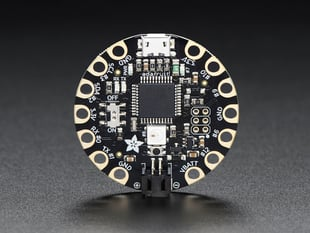
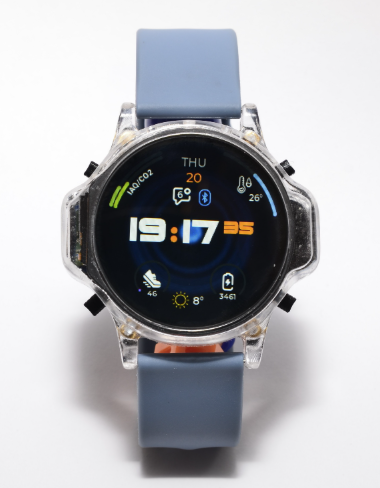

# Legend Motion App

[](https://opensource.org/licenses/MIT)
[](https://www.python.org/)
[](https://flutter.dev/)
[](https://www.espressif.com/)

> 一个完整的可穿戴运动监测项目，从最小集原型到正式产品的开发方案

## 🚀 快速开始

### 运行原型
```bash
cd "02-原型代码/prototype/python"
pip install -r requirements.txt
python app.py
```
访问: http://localhost:5000

## 📁 项目结构

```
Legend Motion App/
├── README.md                    # 项目总览
├── images/                      # 项目图片资源
│   └── README.md               # 图片说明文档
├── 01-项目文档/                  # 项目文档和说明
│   └── 可穿戴开源硬件平台项目.md
├── 02-原型代码/                  # 最小集原型代码
│   └── prototype/
│       ├── index.html
│       ├── css/style.css
│       ├── python/app.py
│       ├── requirements.txt
│       └── README.md
├── 03-硬件资料/                  # 硬件相关文档
│   └── ESP32开发指南.md
├── 04-学习资源/                  # 学习资料和教程
│   ├── Flutter学习路径.md
│   └── 项目开发日志.md
└── 05-设计文件/                  # 设计图和架构图
    └── ZSWatch-Flutter架构图.drawio.svg
```

## 🎯 项目目标

为Legend开发一个运动类APP，需要与硬件传感器关联，考虑到可操作性和后期维护。

## 🚀 快速开始

### 第一阶段：最小集原型 (1-2周)
1. 进入 `02-原型代码/prototype/` 目录
2. 按照README.md的说明运行项目
3. 访问 http://localhost:5000 查看效果

### 第二阶段：硬件集成 (2-3周)
1. 参考 `03-硬件资料/` 中的文档
2. 购买ESP32开发板和传感器
3. 集成真实硬件数据

### 第三阶段：正式开发 (3-4周)
1. 参考 `01-项目文档/` 中的架构设计
2. 使用 `04-学习资源/` 学习Flutter
3. 迁移到ZSWatch + Flutter架构

## 📋 开发计划

- [ ] **第1周**: 完成最小集原型开发
- [ ] **第2周**: 硬件集成和测试
- [ ] **第3周**: UI优化和功能完善
- [ ] **第4周**: 移动端适配
- [ ] **第5周**: 开始Flutter迁移
- [ ] **第6周**: ZSWatch硬件集成
- [ ] **第7周**: 云服务部署
- [ ] **第8周**: 测试和优化

## 💡 技术栈

### 原型阶段
- **硬件**: ESP32开发板 + 传感器
- **前端**: HTML + CSS + JavaScript
- **后端**: Python Flask
- **数据库**: SQLite

### 正式阶段
- **硬件**: ZSWatch智能手表
- **前端**: Flutter + Dart
- **后端**: Node.js + Firebase
- **数据库**: MongoDB

## 🖼️ 图片资源

项目文档中的图片已更新为GitHub兼容格式：

- **Flora开发板**: 
- **ZSWatch**: 
- **架构图**: 

> **注意**: 如需添加图片，请参考 `images/README.md` 中的说明。

## 📚 学习资源

- [Flutter官方文档](https://flutter.dev/docs)
- [ZSWatch项目](https://zswatch.dev/)
- [ESP32开发指南](https://docs.espressif.com/projects/esp-idf/)
- [Python Flask教程](https://flask.palletsprojects.com/)

## 🤝 贡献指南

欢迎提交Issue和Pull Request来改进这个项目！

## 📄 许可证

MIT License
